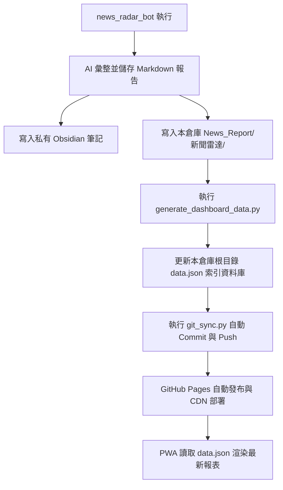

# 📡 新聞雷達 PWA 儀表板 (News Radar Dashboard)

> ✦ **設計語彙**：靜謐奢華 (Quiet Luxury) | 消光純色 | 極細邊框 | 零 Emoji 向量化

這是一個為精明讀者量身打造的**「新聞雷達 PWA 閱讀儀表板」**。本專案作為前端閱讀介面，與後端的自動化機器人 `news_radar_bot` 緊密連動，提供具備離線閱讀能力、極致行動端體驗、以及高階精品視覺質感的漸進式網頁應用 (PWA)。

* **線上預覽 URL**：[https://handpine.github.io/news_radar_dashboard/](https://handpine.github.io/news_radar_dashboard/)

---

## 💎 視覺與互動設計規範 (Design System)

本專案遵循極度嚴苛的**「靜謐奢華 (Quiet Luxury)」**美學協議，徹底摒棄了傳統網頁中花哨、廉價的視覺元素：

1. **色彩系統 (Matte Palette)**
   * **深色模式 (Slate Dark)**：以深煤灰與板岩黑 (`#0c0e12`) 為底色，搭配香檳金 (`#c4a475` / `var(--accent-gold)`) 作為點綴。
   * **淺色模式 (Warm Beige)**：以真絲牙白 (`#f9f8f6`) 為底色，搭配溫潤的灰褐與古銅。
   * **漸層禁忌**：嚴禁使用高飽和度、彩色線性漸層，堅持純色消光與柔和陰影。

2. **零 Emoji 原則 (Anti-Emoji)**
   * 所有 UI 元素、分頁標籤、Toast 彈出式通知中**嚴禁出現任何純文字 Emoji** (如 ❌, ⭐, 📬, 👉, ⚡)。
   * 一律替換為精緻的細線向量 SVG 圖標：
     * **重新整理按鈕**：古典「氣象風向標與導航針 (Wind Vane/Compass)」向量圖案。
     * **Toast 成功回饋**：香檳金「打勾 (Checkmark)」圖示，與收藏星號區隔防止混淆。
     * **我的筆記本**：精細「鋼筆筆尖 (Fountain Pen nib)」圖案。

3. **行動端體驗優化 (Mobile Native UX)**
   * **右滑關閉 (Swipe-to-Close)**：閱讀面板（Reader Sheet）原生支援 `touchstart` / `touchend` 手勢，向右滑動超過 `120px` 即自動滑出返回，極具 Native App 的操控手感。
   * **瀏海屏適配 (Notch Safety)**：Header 與 Reader 頂部安全區完全使用 `env(safe-area-inset-top)` 保護，確保 iOS 與 Android 狀態列不會遮擋返回與功能按鈕。
   * **版面防溢出**：標題與按鈕群組採用彈性彈性盒佈局，長標題自動套用 `text-overflow: ellipsis` 進行字尾截斷，絕不推擠遮蔽交互按鈕。

---

## ⚙️ 系統架構與自動同步數據流 (Data Pipeline)

本專案數據由後端 `news_radar_bot` 每日定時自動推送更新，整體數據流如下：



1. **數據寫入**：Bot 將當天簡報寫入本地 `/News_Report/新聞雷達/` 分類資料夾。
2. **索引編譯**：Bot 掃描目錄並更新根目錄的 `data.json` 索引資料庫，包括日期、快速跳轉錨點與新聞來源。
3. **自動推送**：Bot 在背景安全地執行 `git pull --rebase`、`git add .`、`git commit` 並 `git push` 到 GitHub。
4. **雲端渲染**：GitHub Pages 更新成功，PWA 透過 Fetch `data.json` 自動更新前端內容。

---

## 📂 專案目錄結構

```text
news_radar_dashboard/
├── .github/          # GitHub Actions 部署配置
├── News_Report/      # 歷史簡報 Markdown 存檔
│   └── 新聞雷達/     # 依 YYYY/MM/ 分類歸檔
├── icons/            # PWA 應用圖示 (192px / 512px)
├── index.html        # 主網頁 (整合 CSS/JS 渲染器與 Markdown 解析器)
├── data.json         # 每日與每週簡報的 JSON 索引資料庫
├── manifest.json     # PWA 描述配置檔 (支援安裝為桌面/手機 App)
├── sw.js             # Service Worker 快取與離線閱讀引擎
└── README.md         # 本說明文件
```

---

## 🚀 本地開發與調試

若要在本地環境進行開發與預覽，請使用任何本地 Web 伺服器啟動：

```bash
# 使用 python 啟動本地伺服器
python -m http.server 8000

# 或使用 Node.js 的 serve
npx serve .
```

啟動後瀏覽 `http://localhost:8000` 或對應的 Port 即可。

## 💡 行動端 PWA 踩坑與優化紀錄 (PWA Gotchas & Optimizations)

1. **iOS PWA (Home Screen) 虛擬鍵盤無法喚起 (Suppression Bug)**
   * **問題**：在 iOS 獨立應用模式下，固定定位 (`position: fixed`) 容器內部的 `<textarea>` 或 `<input>` 點選後僅有游標閃爍，無法喚起虛擬鍵盤。
   * **成因**：
     * 字型小於 `16px` 會觸發 WebKit Viewport 自動放大，導致固定定位元素座標偏移而失去焦點。
     * 設定 `body { overflow: hidden }` 鎖定背景滾動，會阻礙 WebKit 移動視窗定位輸入框的行為，從而壓制鍵盤。
     * 父級容器的觸控監聽器（如 `touchstart`/`touchmove` 側滑關閉手勢）未隔離，導致 WebKit 誤判定為非直接使用者互動。
   * **解決方案**：
     * 將輸入框字型強制改為 `16px` 並啟用 `-webkit-user-select: text`。
     * 移除 Drawer 開啟時對 Body 設置 `overflow: hidden` 的邏輯。
     * 在輸入框的觸控事件上呼叫 `e.stopPropagation()`，並在 `touchend`/`click` 時手動檢查並執行 `input.focus()` 以啟動原生聚焦鏈。

2. **Service Worker 離線快取更新延遲 (PWA Update Lag)**
   * **問題**：由於 `index.html` 被列為靜態資源快取優先（Cache-First），即使 Git 倉庫代碼更新並推送，手機 PWA 在開啟時仍會使用舊版快取。
   * **解決方案**：
     * 每次更新靜態資產時手動在 `sw.js` 中升級快取版本名稱（如由 `news-radar-v1` 升至 `news-radar-v3` 等）。
     * 在 `index.html` 中實作自動監聽 `controllerchange` 機制，一旦背景偵測並安裝完新 Service Worker，會自動觸發頁面刷新 (`window.location.reload()`)，確保使用者無感獲取最新修復。

3. **iOS PWA 鍵盤開啟時版面飄移移位 (Layout Drift on Focus) — ⚠️ 前車之鑑：不要動 `bottom`**
   * **問題**：在報告頁面滾動後點選筆記區，鍵盤彈出時整個抽屜面板飛出螢幕。
   * **失敗的嘗試**：動態修改 `sheet.style.bottom = keyboardHeight`。因為 `position: fixed` 元素同時設定 `top: 0` 與 `bottom: X` 會在 iOS layout pass 時觸發連鎖重排，比問題本身更嚴重。
   * **正確解法**：在 `.reader-sheet` 與 `.reader-content` 均加上 `overscroll-behavior-y: none` 阻斷 iOS 橡皮筋回彈，讓 iOS 原生處理 fixed 定位，不干預。

4. **SPA 雜湊狀態與行內錨點快速跳轉衝突 (Hash Route vs Jump Link Conflict)**
   * **問題**：點選日報、週報內部的快速跳轉錨點會導致 Reader 抽屜被直接關閉並退回主畫面。
   * **成因**：為了適配 iOS 手勢側滑返回，我們在 `popstate` 中監聽 `#reader` Hash。點選頁內錨點會改變 URL Hash（如 `#toc-1`），導致 `popstate` 誤判為退出抽屜的返回操作。
   * **解決方案**：在內容容器監聽點擊，當點選目標為頁內錨點時呼叫 `e.preventDefault()` 阻止 Hash 變更，改用 `element.scrollIntoView({ behavior: 'smooth' })` 執行平滑滾動。

5. **`position: fixed` 容器內 `scrollTop` 污染 textarea 觸碰座標 (Coordinate Drift Bug)**
   * **問題**：當使用者在報告內容區滾動後點選筆記 textarea，游標出現在「個人隨手筆記」標題上方，位置錯位恰好等於內部滾動容器的 `scrollTop` 值。
   * **成因**：iOS WebKit 的 hit-testing bug：在 `position: fixed` 容器內，若含有 `overflow-y: auto` 的子滾動容器，WebKit 會將觸碰 y 座標減去該容器的 `scrollTop`，導致其他兄弟元素的 tap 落點計算錯誤。所有 workaround（`scrollIntoView`、重設 `scrollTop`）只能緩解症狀，無法根治。
   * **根治方案（CSS Grid 結構隔離）**：
     * 將 `.reader-sheet` 由 `display: flex` 改為 `display: grid; grid-template-rows: auto 1fr auto`。
     * Header 佔 Row 1，可滾動的內容佔 Row 2（`overflow-y: auto`），筆記區佔 Row 3。
     * **關鍵**：Row 3 的 `textarea` 完全在 grid layout 的座標系中，與 Row 2 的 `scrollTop` 完全隔離，iOS WebKit 座標計算永遠正確。

<!-- Trigger build to clear Pages queue lock -->
