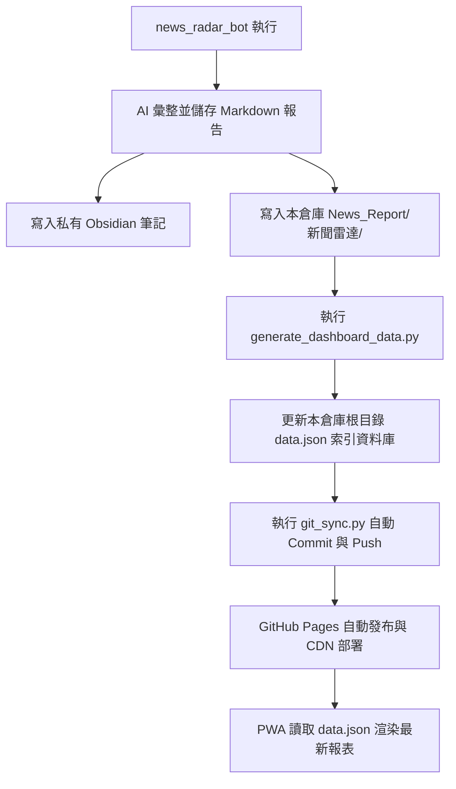

# 📡 新聞雷達 PWA 儀表板 (News Radar Dashboard)

> ✦ **設計語彙**：靜謐奢華 (Quiet Luxury) | 消光純色 | 極細邊框 | 零 Emoji 向量化

這是一個為精明讀者量身打造的**「新聞雷達 PWA 閱讀儀表板」**。本專案作為前端閱讀介面，與後端的自動化機器人 `news_radar_bot` 緊密連動，提供具備離線閱讀能力、極致行動端體驗、以及高階精品視覺質感的漸進式網頁應用 (PWA)。

* **線上預覽 URL**：[https://handpine.github.io/news_radar_dashboard/](https://handpine.github.io/news_radar_dashboard/)

---

## 💎 視覺與互動設計規範 (Design System)

本專案遵循極度嚴苛的**「靜謐奢華 (Quiet Luxury)」**美學協議，徹底摒棄了傳統網頁中花哨、廉價的視覺元素：

1. **色彩系統 (Matte Palette)**
   * **深色模式 (Slate Dark)**：以深煤灰與板岩黑 (`#0c0e12`) 為底色，搭配香檳金 (`#c4a475` / `var(--accent-gold)`) 作為點綴。
   * **淺色模式 (Warm Beige)**：以真絲牙白 (`#f9f8f6`) 為底色，搭配溫潤的灰褐與古銅。
   * **漸層禁忌**：嚴禁使用高飽和度、彩色線性漸層，堅持純色消光與柔和陰影。

2. **零 Emoji 原則 (Anti-Emoji)**
   * 所有 UI 元素、分頁標籤、Toast 彈出式通知中**嚴禁出現任何純文字 Emoji** (如 ❌, ⭐, 📬, 👉, ⚡)。
   * 一律替換為精緻的細線向量 SVG 圖標：
     * **重新整理按鈕**：古典「氣象風向標與導航針 (Wind Vane/Compass)」向量圖案。
     * **Toast 成功回饋**：香檳金「打勾 (Checkmark)」圖示，與收藏星號區隔防止混淆。
     * **我的筆記本**：精細「鋼筆筆尖 (Fountain Pen nib)」圖案。

3. **行動端體驗優化 (Mobile Native UX)**
   * **右滑關閉 (Swipe-to-Close)**：閱讀面板（Reader Sheet）原生支援 `touchstart` / `touchend` 手勢，向右滑動超過 `120px` 即自動滑出返回，極具 Native App 的操控手感。
   * **瀏海屏適配 (Notch Safety)**：Header 與 Reader 頂部安全區完全使用 `env(safe-area-inset-top)` 保護，確保 iOS 與 Android 狀態列不會遮擋返回與功能按鈕。
   * **版面防溢出**：標題與按鈕群組採用彈性彈性盒佈局，長標題自動套用 `text-overflow: ellipsis` 進行字尾截斷，絕不推擠遮蔽交互按鈕。

---

## ⚙️ 系統架構與自動同步數據流 (Data Pipeline)

本專案數據由後端 `news_radar_bot` 每日定時自動推送更新，整體數據流如下：



1. **數據寫入**：Bot 將當天簡報寫入本地 `/News_Report/新聞雷達/` 分類資料夾。
2. **索引編譯**：Bot 掃描目錄並更新根目錄的 `data.json` 索引資料庫，包括日期、快速跳轉錨點與新聞來源。
3. **自動推送**：Bot 在背景安全地執行 `git pull --rebase`、`git add .`、`git commit` 並 `git push` 到 GitHub。
4. **雲端渲染**：GitHub Pages 更新成功，PWA 透過 Fetch `data.json` 自動更新前端內容。

---

## 📂 專案目錄結構

```text
news_radar_dashboard/
├── .github/          # GitHub Actions 部署配置
├── News_Report/      # 歷史簡報 Markdown 存檔
│   └── 新聞雷達/     # 依 YYYY/MM/ 分類歸檔
├── icons/            # PWA 應用圖示 (192px / 512px)
├── index.html        # 主網頁 (整合 CSS/JS 渲染器與 Markdown 解析器)
├── data.json         # 每日與每週簡報的 JSON 索引資料庫
├── manifest.json     # PWA 描述配置檔 (支援安裝為桌面/手機 App)
├── sw.js             # Service Worker 快取與離線閱讀引擎
└── README.md         # 本說明文件
```

---

## 🚀 本地開發與調試

若要在本地環境進行開發與預覽，請使用任何本地 Web 伺服器啟動：

```bash
# 使用 python 啟動本地伺服器
python -m http.server 8000

# 或使用 Node.js 的 serve
npx serve .
```

啟動後瀏覽 `http://localhost:8000` 或對應的 Port 即可。

> 💡 **注意事項**：若在手機上測試發現 UI 未更新，是由於 Service Worker 與 GitHub CDN 快取所致。請直接清除瀏覽器快取，或將 PWA 應用重新啟動即可看到最新版本。
